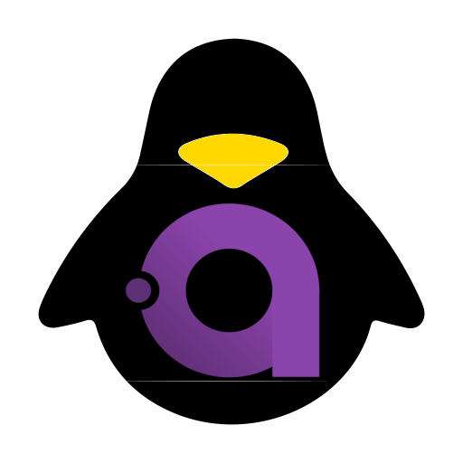

# KD.Avalonia.Rice



Avalonia 12 library: frameless `RiceWindow` with a custom title bar and Linux distro inspired themes
(Ubuntu, Fedora, Manjaro, openSUSE, Nord, Solarized, Dracula, Gruvbox, Catppuccin – each with light and dark variants).

## Usage

```csharp
AppBuilder.Configure<App>()
    .UsePlatformDetect()
    .UseRice(o =>
    {
        o.AppInfo = new RiceAppInfo { AppId = "my-app", Name = "My App", Author = "me",
                                      IconUri = "avares://MyApp/Assets/icon.png" };
        o.SupportedThemes = [BuiltInThemes.Ubuntu, BuiltInThemes.Nord, BuiltInThemes.Dracula];
        o.DefaultThemeId = "ubuntu";
    });
```

```xml
<!-- App.axaml: replaces FluentTheme -->
<Application.Styles>
  <rice:RiceStyles />
</Application.Styles>

<!-- MainWindow.axaml -->
<rice:RiceWindow ShowSettingsButton="True" ShowAboutButton="True" SettingsRequested="OnSettings">
  ...
</rice:RiceWindow>

<!-- inside your settings view -->
<rice:ThemeSelector />
```

- **Light/Dark** follows the system on startup; the title bar button switches it for the session only (not saved).
- **Theme** (`ThemeManager.Instance.CurrentTheme`) is saved to `~/.config/<AppId>/rice.json` when the app supports more than one theme.
- The about button opens a built-in dialog (name, author, version); handle `AboutRequested` to replace it.
- Brushes for your own controls: `RiceAccentBrush`, `RiceBackgroundBrush`, `RiceSurfaceBrush`, `RiceForegroundBrush`, `RiceForegroundMutedBrush`, `RiceBorderBrush`, … (use `DynamicResource`).
- Custom themes: `new RiceTheme("id", "Name", Light: new RicePalette(accent, bg, surface, fg), Dark: ...)`.
- Texts can be localized via `RiceStrings`.

## Demo

```sh
dotnet run --project samples/KD.Avalonia.Rice.Demo
```

## Versioning & NuGet package

Every build of `src/KD.Avalonia.Rice` produces `artifacts/packages/KD.Avalonia.Rice.<version>.nupkg` (+ `.snupkg`).
The version comes from [Nerdbank.GitVersioning](https://github.com/dotnet/Nerdbank.GitVersioning):
the version is `<yy>.<month>.<git height>` (e.g. `26.10.5`): `version.json` holds year.month, the patch is the number
of commits since it was set. The build warns when `version.json` is not the current month – bump it by editing the file
(not with `nbgv set-version`, which drops the other settings).
Builds on `main`/`master` or `v*` tags get a clean version; other branches get a `-g<commit>` suffix.

```sh
dotnet pack -c Release src/KD.Avalonia.Rice   # release package
```

## Icon

The package icon (`src/KD.Avalonia.Rice/Assets/icon.png`) is based on the
[Linux icon](https://www.iconarchive.com/show/material-icons-by-pictogrammers/linux-icon.html)
from the Material Icons set by Pictogrammers, licensed under the
[Apache License 2.0](https://www.apache.org/licenses/LICENSE-2.0).
